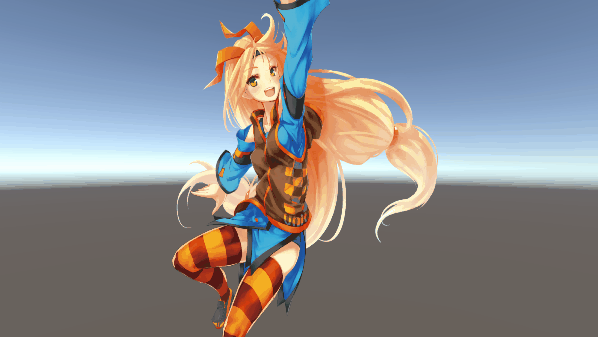
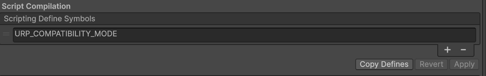
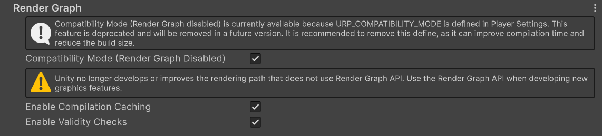
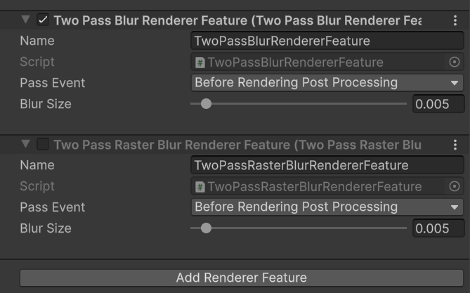

[English verion](./README.md)

# RenderGraphWebinarSample01
Render Graph を用いて 2 pass blur を行うサンプルコードです。

## Requirement  
- Unity 6000.3.3f1 LTS

## Getting the project
- このレポジトリをクローンするかプロジェクトのzipをダウンロードします
- プロジェクトを Unity Editor で開きます (Requirement セクションに記載しているバージョンを使用してください)

## How to use
“Assets/TwoPassBlur.unity” シーンを開き、再生ボタンを押します。

`URP_COMPATIBILITY_MODE` scripting define symbol はすでにセットされており、Render Graph Compatiblity Mode は有効になっています。Render Graph を使用したレンダリングを確認したい場合は Compatiblity Mode をオフにしてください。描画結果に変化がありませんが、Render Graph が使用され描画が行われています。

`Blur_Render.asset` は現在 Unsafe Pass を使用する TwoPassBlurFeature が使用されていますが、Raster Render Pass を使用したものを確認したい場合、TwoPassBlurFeature を無効にして、TwoPassRasterBlurRendererFeature を有効にしてください。TwoPassRasterBlurRendererFeature は Compatiblity Mode に対応していません。

## LICENSE

このリポジトリに含まれる **ソースコード** は **Unity Companion License** のもとで公開されています。

ただし、以下のアセットは **Unity Companion License の対象ではありません**。

- `Assets/01_TwoPassBlur/Hello_Unity-Chan.png`

このアセットは、株式会社ユニティ・テクノロジーズ・ジャパンが提供する  
**Unity-chan License（UCL）** に基づいて利用・再配布されています。

詳細については、公式の Unity-chan License を参照してください。  
https://unity-chan.com/contents/license_jp/